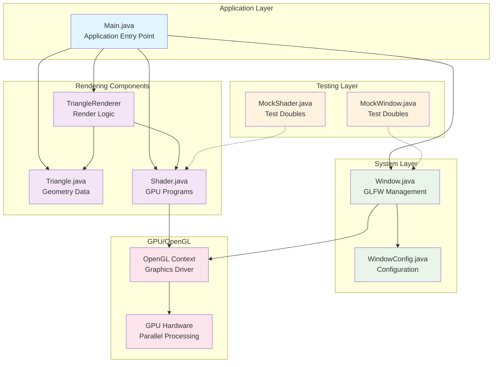

# Graphics Renderer Documentation

This documentation explains the complex features and technical implementation of the LWJGL-based graphics renderer. The codebase implements a modern OpenGL Core Profile (3.3) rendering system with comprehensive Test-Driven Development (TDD) approach.

## Documentation Structure

### Core Technical Documentation

#### 🎨 [Graphics Pipeline](graphics-pipeline.md)
**Purpose**: Comprehensive explanation of the graphics rendering pipeline implementation
**Covers**:
- Complete pipeline stages from vertex specification to framebuffer output
- VBO/VAO setup and GPU memory management
- Shader compilation and linking process
- State management and resource lifecycle
- Pipeline data flow diagrams

**Key Concepts**: OpenGL Core Profile, Vertex Attributes, Shader Programs, GPU Memory Transfer

#### 🖥️ [GPU Operations](gpu-operations.md)
**Purpose**: Deep dive into GPU architecture and OpenGL technical details
**Covers**:
- GPU parallel processing model (SIMD architecture)
- Memory hierarchy (CPU → Native → GPU VRAM)
- OpenGL state machine concepts
- Shader compilation pipeline on GPU
- Performance characteristics and bottleneck analysis
- OpenGL Core Profile implications

**Key Concepts**: GPU Cores, Memory Bandwidth, Rasterization, Fragment Processing

#### 🏗️ [Software Architecture](architecture.md)
**Purpose**: Code architecture, design patterns, and software engineering principles
**Covers**:
- Test-Driven Development (TDD) architecture
- Separation of concerns and component design
- Resource management patterns
- Error handling and defensive programming
- Immutability and thread safety
- Performance-oriented design decisions

**Key Concepts**: TDD, RAII, Component Architecture, Dependency Injection

#### 🧪 [Testing & Monitoring](testing-monitoring.md)
**Purpose**: Testing strategies and monitoring implementation
**Covers**:
- Mock-based testing for hardware independence
- Comprehensive test coverage patterns
- Runtime monitoring and lifecycle tracking
- OpenGL error monitoring
- Performance monitoring opportunities
- CI/CD considerations

**Key Concepts**: Mock Testing, Validation-First Design, Resource Tracking

### Maintenance Documentation

#### 📋 [Maintenance Rules](maintenance-rules.md)
**Purpose**: Guidelines for keeping documentation up-to-date
**Covers**:
- When to update documentation (triggers and requirements)
- Documentation quality standards
- Code review checklist for documentation
- Automation opportunities
- Responsibility matrix for different change types

**Key Concepts**: Documentation-as-Code, Continuous Documentation, Review Process

## Quick Navigation

### By Feature Type
- **Graphics Pipeline Features** → [graphics-pipeline.md](graphics-pipeline.md) + [gpu-operations.md](gpu-operations.md)
- **Architecture Changes** → [architecture.md](architecture.md) + [testing-monitoring.md](testing-monitoring.md)
- **OpenGL/GPU Features** → [gpu-operations.md](gpu-operations.md) + [graphics-pipeline.md](graphics-pipeline.md)
- **Testing Patterns** → [testing-monitoring.md](testing-monitoring.md) + [architecture.md](architecture.md)

### By Complexity Level
- **Beginner**: Start with [architecture.md](architecture.md) for overall design
- **Intermediate**: Move to [graphics-pipeline.md](graphics-pipeline.md) for rendering concepts
- **Advanced**: Deep dive into [gpu-operations.md](gpu-operations.md) for GPU details
- **Expert**: Study [testing-monitoring.md](testing-monitoring.md) for testing patterns

### By Role
- **Graphics Programmer** → [graphics-pipeline.md](graphics-pipeline.md) → [gpu-operations.md](gpu-operations.md)
- **Software Architect** → [architecture.md](architecture.md) → [testing-monitoring.md](testing-monitoring.md)
- **Test Engineer** → [testing-monitoring.md](testing-monitoring.md) → [architecture.md](architecture.md)
- **Maintainer** → [maintenance-rules.md](maintenance-rules.md) → All files

## Documentation Standards

### Code References Format
All documentation uses this format for code references:
```markdown
**Location**: `ClassName.methodName()` in `filename.java` lines 123-456
```

### Technical Explanations
Each technical concept includes:
- **What**: Brief description of the concept
- **Why**: Explanation of why this approach is used
- **How**: Implementation details with code examples
- **Performance**: Impact on performance when relevant

### Diagram Usage
Complex relationships are illustrated using Mermaid diagrams:
- **Data Flow**: How data moves through the system
- **Component Relationships**: How classes interact
- **Pipeline Stages**: Sequential processing steps

## Codebase Architecture Overview



## Getting Started

1. **New to Graphics Programming**: Begin with [graphics-pipeline.md](graphics-pipeline.md) to understand the rendering flow
2. **Interested in Architecture**: Start with [architecture.md](architecture.md) to see the design patterns
3. **Want to Understand Testing**: Read [testing-monitoring.md](testing-monitoring.md) for the TDD approach
4. **Need GPU Details**: Jump to [gpu-operations.md](gpu-operations.md) for hardware specifics
5. **Contributing Code**: Review [maintenance-rules.md](maintenance-rules.md) for documentation requirements

## Key Learning Outcomes

After reading this documentation, you should understand:

### Graphics Programming
- Modern OpenGL Core Profile usage
- Graphics pipeline stages and GPU operations
- Shader compilation and resource management
- Performance optimization strategies

### Software Engineering
- Test-Driven Development in graphics programming
- Clean architecture and separation of concerns
- Resource lifecycle management
- Mock-based testing strategies

### System Design
- Component-based architecture
- Error handling and defensive programming
- Performance-conscious design decisions
- Hardware abstraction patterns

This documentation is maintained according to the rules in [maintenance-rules.md](maintenance-rules.md) and is updated with every significant code change. 