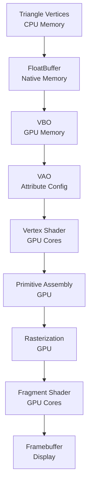

# Graphics Pipeline Implementation

## Overview

The graphics pipeline in this LWJGL-based renderer implements a modern OpenGL Core Profile (3.3) rendering system. The pipeline transforms 3D vertex data through multiple programmable stages to produce the final rendered image on screen.

## Pipeline Stages Implementation

### 1. Vertex Specification
**Location**: `Triangle.java` lines 18-42, `Main.java` lines 98-110

The vertex specification stage defines the input data format. Our implementation uses an **interleaved vertex buffer** approach:

```java
// Triangle vertices: position (x,y,z) + color (r,g,b)
float[] vertices = {
    // Top vertex (red)
     0.0f,  0.6f, 0.0f,   1.0f, 0.0f, 0.0f,
    // Bottom-left vertex (green)
    -0.6f, -0.6f, 0.0f,   0.0f, 1.0f, 0.0f,
    // Bottom-right vertex (blue)
     0.6f, -0.6f, 0.0f,   0.0f, 0.0f, 1.0f
};
```

**Technical Implementation**:
- **Vertex Stride**: 6 floats per vertex (VERTEX_STRIDE = 6)
- **Data Layout**: [x, y, z, r, g, b] per vertex
- **Validation**: Strict validation ensures exactly 18 floats (3 vertices × 6 components)

### 2. Vertex Buffer Objects (VBO) Setup
**Location**: `TriangleRenderer.setupBuffers()` in `Main.java` lines 163-188

The VBO implementation manages GPU memory allocation and data transfer:

```java
// Create buffer with triangle data
FloatBuffer vertexBuffer = BufferUtils.createFloatBuffer(triangle.getVertices().length);
vertexBuffer.put(triangle.getVertices()).flip();

// Bind and upload VBO
GL15.glBindBuffer(GL15.GL_ARRAY_BUFFER, vbo);
GL15.glBufferData(GL15.GL_ARRAY_BUFFER, vertexBuffer, GL15.GL_STATIC_DRAW);
```

**GPU Memory Management**:
- **Buffer Type**: `GL_ARRAY_BUFFER` for vertex attributes
- **Usage Pattern**: `GL_STATIC_DRAW` optimizes for data uploaded once, drawn many times
- **Memory Transfer**: Java heap → native memory → GPU VRAM

### 3. Vertex Array Objects (VAO) Configuration
**Location**: `TriangleRenderer.setupBuffers()` lines 175-188

VAOs encapsulate vertex attribute configuration, providing a state container:

```java
// Position attribute (location 0)
GL20.glVertexAttribPointer(0, 3, GL11.GL_FLOAT, false, 6 * Float.BYTES, 0);
GL20.glEnableVertexAttribArray(0);

// Color attribute (location 1)  
GL20.glVertexAttribPointer(1, 3, GL11.GL_FLOAT, false, 6 * Float.BYTES, 3 * Float.BYTES);
GL20.glEnableVertexAttribArray(1);
```

**Attribute Specification**:
- **Location 0**: Position (3 floats, offset 0)
- **Location 1**: Color (3 floats, offset 12 bytes)
- **Stride**: 24 bytes between vertices (6 floats × 4 bytes)

### 4. Vertex Shader Stage
**Location**: `Main.createTriangleShader()` lines 112-124

The vertex shader processes each vertex individually:

```glsl
#version 330 core
layout (location = 0) in vec3 aPos;    // Matches VAO location 0
layout (location = 1) in vec3 aColor;  // Matches VAO location 1

out vec3 vertexColor;  // Pass color to fragment shader

void main() {
    vertexColor = aColor;
    gl_Position = vec4(aPos, 1.0);  // Transform to clip space
}
```

**GPU Operations**:
- **Input**: Per-vertex position and color from VBO
- **Processing**: Direct passthrough (no transformations)
- **Output**: `gl_Position` (clip space) + `vertexColor` (interpolated)

### 5. Primitive Assembly & Rasterization
**Location**: Implicit in `GL11.glDrawArrays(GL11.GL_TRIANGLES, 0, 3)`

The GPU automatically handles:
- **Triangle Formation**: Groups 3 vertices into triangles
- **Clipping**: Against frustum planes (none needed for our 2D triangle)
- **Rasterization**: Converts triangles to fragments (pixels)

### 6. Fragment Shader Stage
**Location**: `Main.createTriangleShader()` lines 126-135

The fragment shader determines final pixel colors:

```glsl
#version 330 core
in vec3 vertexColor;   // Interpolated from vertex shader
out vec4 FragColor;    // Final pixel color

void main() {
    FragColor = vec4(vertexColor, 1.0);  // RGB + alpha
}
```

**GPU Operations**:
- **Input**: Interpolated vertex attributes
- **Processing**: Color passthrough
- **Output**: RGBA color for framebuffer

### 7. Per-Fragment Operations
**Location**: Implicit in OpenGL pipeline

The GPU performs:
- **Depth Testing**: Disabled (no depth buffer)
- **Blending**: Disabled (opaque rendering)
- **Framebuffer Writing**: Direct color writing

## Pipeline Efficiency Features

### State Management
**Location**: `TriangleRenderer.render()` lines 190-197

Efficient state switching minimizes GPU driver overhead:

```java
public void render() {
    shader.use();              // Bind shader program
    GL30.glBindVertexArray(vao); // Bind vertex state
    GL11.glDrawArrays(GL11.GL_TRIANGLES, 0, triangle.getVertexCount());
    GL30.glBindVertexArray(0);   // Unbind for safety
    shader.unuse();            // Unbind shader
}
```

### Resource Lifecycle
**Location**: `TriangleRenderer.destroy()` lines 199-202

Proper GPU resource cleanup prevents memory leaks:

```java
public void destroy() {
    GL15.glDeleteBuffers(vbo);      // Free GPU buffer memory
    GL30.glDeleteVertexArrays(vao); // Free VAO object
}
```

## Pipeline Data Flow



This implementation demonstrates a complete modern graphics pipeline with proper resource management, efficient state handling, and GPU-optimized data flow. 